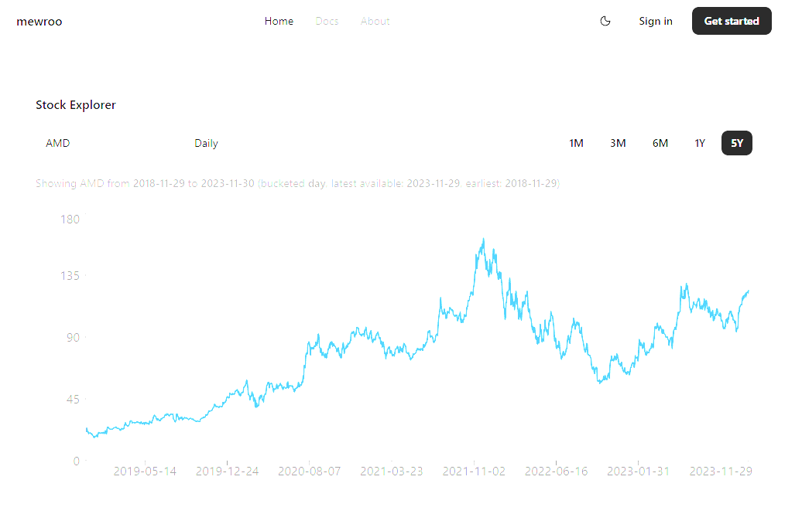

# mewroo

This repository contains a full-stack web application with:

- Frontend: React + Vite + Tailwind v4 + shadcn/ui
- Backend: FastAPI
- Analytics Database: ClickHouse (OLAP)

The frontend and backend live in the same repo but are clearly separated and run together using Docker Compose.

---

DATASET SETUP (REQUIRED FOR ANALYTICS)

This project uses a real-world historical stock price dataset stored in
ClickHouse for analytics.

Because the dataset is large, it is NOT committed to git and must be
downloaded locally.

---

1. DOWNLOAD THE DATASET

Download the dataset from Kaggle:

https://www.kaggle.com/datasets/iveeaten3223times/massive-yahoo-finance-dataset

You must be logged into Kaggle to download the file.

---

2. EXTRACT THE CSV

After downloading, unzip the archive and locate the file:

stock_details_5_years.csv

---

3. PLACE THE CSV IN THE EXPECTED DIRECTORY

Move the CSV file to the following path in this repository:

backend/db_clickhouse/data/stock_details_5_years.csv

IMPORTANT:
This file is intentionally ignored by git and MUST NOT be committed.

---

4. START THE APPLICATION

To initialize ClickHouse and import the dataset, run:

docker compose down -v
docker compose up --build

Notes:

- The -v flag is required the first time to ensure ClickHouse runs its
  initialization scripts.
- On startup, ClickHouse will automatically:
  - create the stock_prices table
  - import the CSV data

---

5. VERIFY THE IMPORT (OPTIONAL)

You can verify that the data was loaded successfully with:

docker exec -it mewroo-clickhouse-1 clickhouse-client \
 --user mewroo --password mewroo \
 --query "SELECT Company, count() FROM stock_prices GROUP BY Company ORDER BY count() DESC LIMIT 10"

---

WHY CLICKHOUSE?

ClickHouse is used as an OLAP database optimized for:

- time-series data
- analytical queries
- fast aggregations over large datasets

User and account data will be added later using a separate OLTP database
(e.g. PostgreSQL).

---

REPOSITORY STRUCTURE

mewroo/
├── frontend/ # React + Vite frontend
├── backend/ # FastAPI backend
│ └── db_clickhouse/
│ ├── init/ # ClickHouse schema + seed SQL
│ └── data/ # Local CSV data (gitignored)
├── docker-compose.yml
└── README.txt

---

WHAT'S NEXT

Planned next steps:

1. Add analytics-focused API endpoints:

   - /api/finance/symbols
   - /api/finance/latest?symbol=AAPL
   - /api/finance/history?symbol=AAPL&days=365

2. Add frontend visualizations:

   - price history charts
   - symbol selector

3. Add a PostgreSQL database for user and authentication data

---
